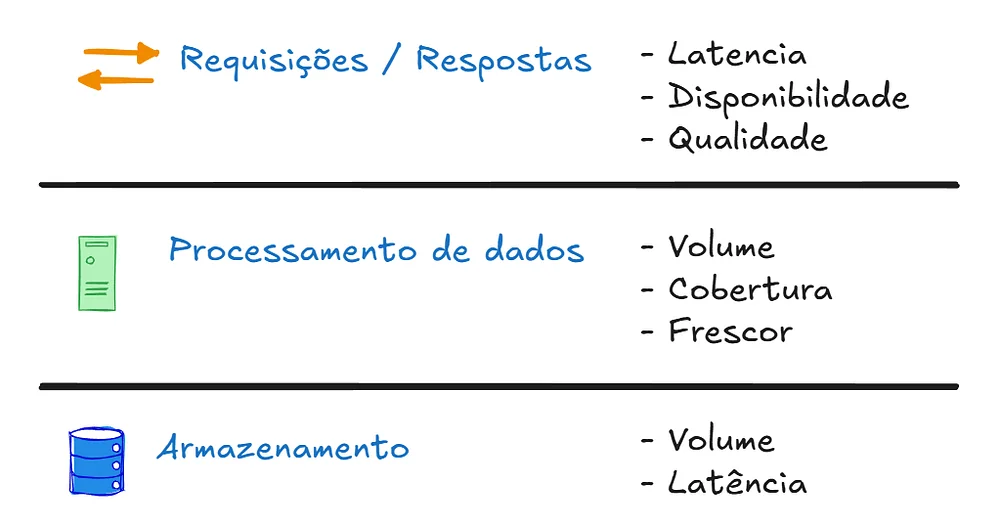
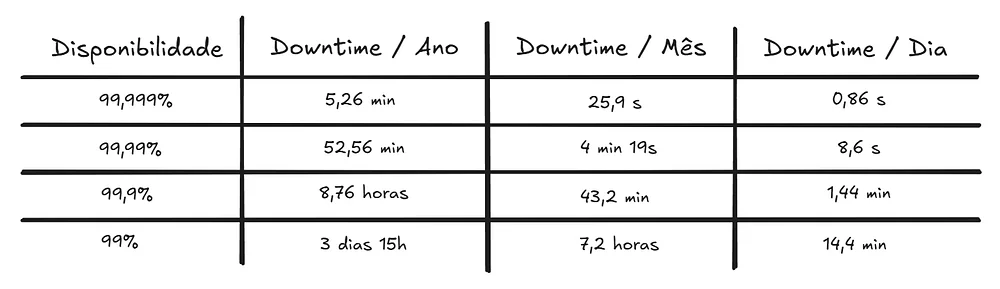
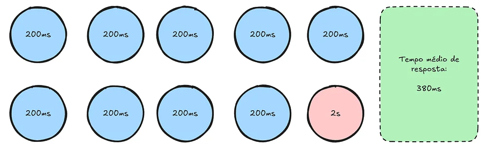
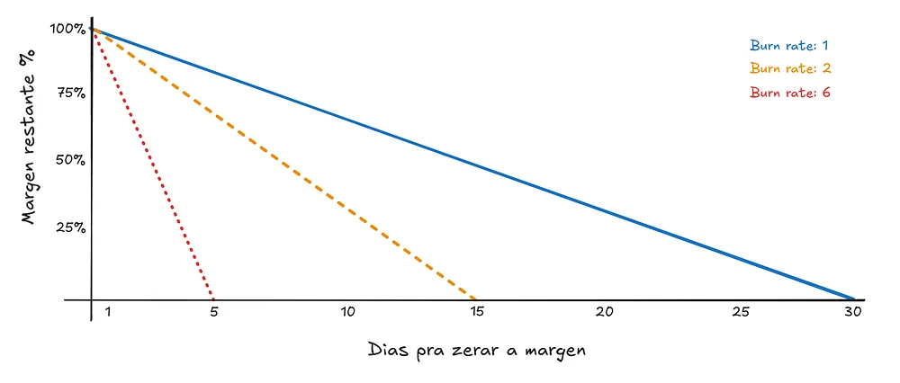

## The software engineering dilemma

> The conflict is simple: innovate fast or keep the system stable.

All software engineering lives with a permanent conflict: innovation vs. resilience. The innovation side sets out to bring new features and change flows, aiming to make the product more attractive to the customer.

Resilience, or trust, on the other hand, takes on the job of slowing changes down, because any change is a risk of breaking something that already exists or of degrading the user experience.

### The impact on the user

In the end, all this technical discussion ends up in the same place: the user. Even if it gets there by different paths. Finding the balance between the two sides is no simple task, and the consequences of an imbalance between them can be the end of a product.

### When innovation becomes a problem

Startups are companies at the very start of their lives; they have an innovation they're trying to bring to market and they can't afford to lose ground. So shipping 7 new features a week becomes routine.

The team is pressured to cut down on testing time or deploy freezes, because they can't leave the customer waiting. With a growing focus on feature volume, product quality tends to decay the longer this routine lasts.

Until you reach the point where the tickets being opened are no longer about new features, but about how the user had to wait 10s on the Loading screen when transferring items.

The user's trust in the product keeps degrading over time. Until it reaches the point of churn. After all,

> The user doesn't need the best product. They need the product that works.

### The problem happens at the other extreme

Working at established companies, with thousands of lines of code and thousands of users relying on your product every day, demands a lot of responsibility. Imagine taking down a traditional (financial) bank out of carelessness — companies of that size can't afford that luxury.

There's a team specialized in keeping the system running; they usually have a strict release policy, with lots of tests and subject to freezes. But each of these processes increases cost and delivery time.

The end user asks for new features, the product has a slow process, and the customer becomes dissatisfied. After all, the competitors have every feature they've been asking for. So they churn, migrating to another platform.

Engineering begins when opinion turns into a metric. To stop arguing over whether the system is "good" or "bad" based on gut feeling, we need to turn the user's feeling of frustration into math. This is where the SLI comes in.

---

## SLI or Service Level Indicator

Known as Service Level Indicators, they are the data collected from a flow that matters to the user, indicating the state of that service at the moment it's collected.

In practice, it usually shows up as a simple calculation.

> But a value without context is just a pretty number on the dashboard.

The indicator you get won't add real value if that indicator isn't relevant to the user or isn't the core of the product.

In a product whose purpose is to store information and return it at low latency, is the "Change profile picture" flow important enough to be monitored?

There's no global SLI that fits every product. On the contrary, each product requires an analysis of the context it sits in for the SLI to be defined. Because the SLI is a way of knowing what users are perceiving about that service.

There's a pattern to SLIs; they usually measure:

The most common are Latency and Availability, because the user should be able to use the product whenever they please, without having to wait seconds.

What's the most Pix transactions you've made in a single day? The Banco Central has processed as many as **313 million transactions in 24 hours**. Measuring the volume of data processed is essential for banking systems. After all, if some transactions fall behind, every transaction after them will suffer.

A major bottleneck for many companies is Storage (the Database), because they don't watch out for poorly optimized queries or missing indexes. Not measuring this delay leaves room to believe the problem lies in some other part of the code.

Once the SLIs are defined, once we've defined "what to observe," we need to know when the indicators are healthy or showing risk. That's when we define the SLO.

## SLO or Service Level Objective

The targets must be realistic. Not only do SLIs depend on the user's context, but SLOs depend on the context the product finds itself in.

Big Tech companies don't set targets like *"Availability of Service X must be 99.999%."* They discuss, research, and understand the context to see whether it's feasible for the service to have that much availability. On top of that, the SLO varies by flow and by product.

> Reliability isn't free.

Each extra "9" in the target is expensive. After all, availability of 99.999% means the system can only be down for a mere 5.26 minutes per year. To guarantee a margin of error that tight, every release needs near-absolute certainty that it won't cause instability, which demands exhaustive testing and expensive infrastructure, built on redundancy upon redundancy.

In critical cases, or in more everyday scenarios, public tenders come with minimum operating requirements. This is where formality begins.

## SLA or Service Level Agreement

So far we've been talking about engineering. The SLA takes this into a formal contract, between the party responsible for the product and the user.

The contract describes how the service must work, what happens in the event of failures, and what the indicators, tolerances, and penalties for non-compliance are.

Very common in public tenders, where there are fines or even contract terminations if the system goes down for longer than the terms stated.

If the SLA is set at 99% availability, that doesn't mean a 99% SLO will be handed down to the development team. After all, you need a safety margin for the unexpected.

If the contract says 99%, how do we make sure we're not fooling ourselves with averages?

---

## How data deceives you

As you step into the world of metrics and observability, the average is abandoned and replaced by percentiles, p95 and p99. Because they reveal the experience of the worst-off user. But how?

In a scenario where 9 out of every 10 requests are answered in 200ms, but one of them takes **2 seconds**, the average time rises to just 380ms.

That value doesn't actually represent the experience that matters; percentiles focus on the worst cases. The p99 captures the response time of the slowest 1% — which is what really shows the users' experience.

## When to innovate and when to stabilize?

The Error Budget is the amount of "pain" or instability a service can accumulate before users become dissatisfied. In practice, it turns a subjective discussion into a decision-making policy.

- If you have budget: You're allowed to innovate fast, ship risky deploys, and test new features.
- If the budget is gone: The priority shifts instantly. Innovation stops and engineering's entire focus turns to the resilience and stability of the system.

The math is simple and it exists to quantify risk. If the defined SLO is 99.5% availability, our error budget for that period is 0.5%.

But when the indicator hits the limit or goes past it, what measures should the team and leadership take? Actions like freezes will be applied, but not as punishment — as a necessity:

1. Deploy Freeze: You halt the release of any new features that aren't bug fixes.
2. Focus on Post-mortems: You deeply analyze why the budget was spent, to prevent recurrence.
3. Investment in Automation: The time that would be spent innovating is redirected into building tests and tools that ensure the system can handle the next wave of changes.

Waiting for the margin of error to run out before making a choice is the opposite of software engineering. Its whole point is to foresee and mitigate these scenarios. So sitting back and waiting is unacceptable.

## Stop being reactive

Having an Error Budget is liberating, but it has a problem: if we only look at the final balance, we might find out too late that it's gone. This is where the Burn Rate comes in.

> The Burn Rate doesn't just measure the error; it measures the speed at which the margin of error is spent.

It lets you predict when the budget will be exhausted. When the speed is higher than expected, it can be configured to fire alerts warning the team that a choice needs to be made.

Software Engineering isn't about chasing the perfection of 100% availability, but about having the maturity to accept error as an inherent part of growth. It seeks to find the balance between **innovation** and **stability**.

The *Error Budget* isn't a punishment; it's the currency that bought your permission to take risks, learn, and evolve. Because,

> Metrics don't exist to prove the system is working, but to make sure the user behind the screen still trusts us.

---

## References

- [Google  -  The Art of SLOs](https://sre.google/resources/practices-and-processes/art-of-slos/)
- [IaC  -  SLA,SLI,SLO](https://infraascode.com.br/sla-sli-slo/)
- [Google SRE book  -  Service Level Objectives](https://sre.google/sre-book/service-level-objectives/)
- [Google  -  Error Budget](https://sre.google/sre-book/embracing-risk/#xref_risk-management_unreliability-budgets)
- [DeepTech Occult  -  Quantas requisições um servidor aguenta?](https://www.youtube.com/watch?v=xbZ4rhQYa7E)
- [Nobl9  -  SLO](https://www.nobl9.com/service-level-objectives)
