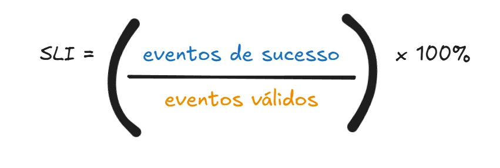
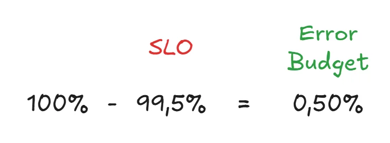

## O dilema da engenharia de software

> O conflito é simples: inovar rápido ou manter o sistema estável.

Toda engenharia de software vive um conflito permanente. A inovação vs resiliência, o lado da inovação se propõe a trazer novas funcionalidades, mudar fluxos, a fim de, deixar o produto mais atrativo para o cliente.

Enquanto que na resiliência, ou confiança, se responsabiliza por atrasar as mudanças, pois qualquer mudança é um risco de quebrar algo que já existe ou de piorar a experiência do usuário.

### O impacto no usuário

No fim, toda essa discussão técnica termina no mesmo lugar: o usuário. Mesmo que através de meios distintos. Encontrar o equilíbrio entre ambas as partes não é uma tarefa simples e as consequências de um desequilíbrio entre elas pode ser o fim de um produto.

### Quando inovação vira problema

Startups são empresas que estão no início de vida, possuem uma inovação que buscam trazer para o mercado e não podem perder espaço no mercado. Logo trazer 7 funcionalidades novas por semana se torna rotina.

A equipe fica pressionada a reduzir tempo em testes ou freezing de deploy, pois não podem deixar o cliente aguardando. Com o foco crescente em volume de funcionalidades, a qualidade do produto tende a decair quanto mais tempo essa rotina dura.

Até chegar no ponto onde os chamados abertos deixarão de ser novas funcionalidades e serão sobre como ao fazer uma transferência de itens o usuário teve que esperar 10s na tela de Loading.

A confiança do usuário sobre o produto vai se degradando no decorrer do tempo. Chegando ao ponto de churn. Afinal,

> O usuário não precisa do melhor produto. Ele precisa do produto que funciona.

### O problema acontece no outro extremo

Trabalhar em empresas ligadas, com milhares de linhas de código e milhares de usuários que usam diariamente o seu produto, requer muita responsabilidade. Imagine, derrubar um Banco (financeiro) tradicional por falta de cuidado, empresas desse porte não podem ter esse luxo.

Há um time especializado em manter o sistema funcionando, normalmente possuem uma política de release rígida, com muitos testes e sujeito à freezing. Mas, cada processo desse aumenta custo e tempo de entrega.

O usuário final pede funcionalidades novas, o produto possui um processo lento e o cliente fica insatisfeito. Afinal, os concorrentes possuem todas as funcionalidades que ele vem pedindo. Então ele vira churn, migrar de plataforma.

A engenharia começa quando a opinião vira métrica. Para parar de discutir se o sistema está "bom" ou "ruim" com base em achismos, precisamos transformar o sentimento de frustração do usuário em matemática. É aqui que entra o SLI.

---

## SLI ou Service Level Indicator

Conhecidos como Indicador de nível de serviço, são os dados coletados a partir de um fluxo importante para o usuário que indicam o estado daquele serviço no momento de sua coleta.

Na prática, ele costuma aparecer como uma conta simples.

> Mas um valor sem contexto é só um número bonito no dashboard.

O indicador obtido não agregará valor real, caso o indicador obtido não seja relevante para o usuário ou não seja o core do produto.

Em um produto com propósito em armazenar informações e devolvê-las em baixa latência, o fluxo de "Alterar foto de perfil" é tão importante a ponto de ser monitorado?

Não existe um SLI global para todos os produtos. Pelo contrário, cada produto requer uma análise do contexto que está inserido para ser definido o SLI. Pois, o SLI serve como meio saber o que os usuários estão percebendo daquele serviço.

Há um padrão nos SLI, normalmente eles medem:

Os mais comuns são Latência e Disponibilidade, pois o usuário deve estar apto a usar o produto quando ele bem entender e sem ter que esperar segundo.

Qual o máximo de pix que você fez em um dia? O Banco Central já chegou a processar **313 milhões de transações em 24 horas**. Medir o volume de dados processados é fundamental para sistemas bancários, Afinal, se algumas transações atrasam todas depois delas vão sofrer.

Um grande gargalo para muitas empresas é o Armazenamento (Banco de Dados), pois não tomam cuidado com consultas má otimizadas ou pela falta de índices. Não medir esse tempo de demora deixa espaço para acreditar que o problema está em outra parte do código.

Após a definição dos SLIs, após definir "O que observar", é necessário saber quando os indicadores estão saudáveis ou demonstram riscos. É quando definimos o SLO.

## SLO ou Service Level Objective

As metas devem ser realistas, não só os SLI dependem do contexto do usuário, como os SLOs dependem do contexto que o produto se encontra.

BigTechs não colocam metas como de *"Disponibilidade do Serviço X deve ser 99.999%"*. Eles discutem, pesquisam e entendem o contexto para ver se é viável o serviço ter tanta disponibilidade. Além disso, o SLO varia por fluxo e produto.

> A confiabilidade não é grátis.

Cada "9" a mais na meta custa caro. Afinal, uma disponibilidade de 99,999% significa que o sistema só pode ficar fora do ar por meros 5,26 minutos por ano. Para garantir uma margem de erro tão apertada, cada release precisa ter a certeza quase absoluta de que não causará instabilidade, o que exige testes exaustivos e uma infraestrutura cara, baseada em redundância sobre redundância.

Em casos críticos, ou cenários mais cotidianos, em licitações há requisitos mínimos de funcionamento. Aqui inicia-se a formalidade.

## SLA ou Service Level Agreement

Até aqui falamos de engenharia. O SLA leva isso para o contrato formal, entre o responsável pelo produto e o usuário.

O contrato descreve como o serviço deve funcionar, o que acontece em falhas e quais os indicadores, tolerâncias e as penalidades no descumprimento.

Muito comum em licitações, onde há multas ou até rescisões caso o sistema fique fora do ar mais do que o termo disse.

Caso o SLA seja definido com 99% de disponibilidade, não significa que, será repassado para o time de desenvolvimento um SLO de 99%. Afinal, é necessário ter uma margem de segurança para imprevistos.

Se o contrato diz 99%, como garantimos que não estamos enganando a nós mesmos com médias.

---

## Como dados te enganam

Adentrando o mundo de métricas e observabilidade a média é abandonada e será substituída pelos percentis, os p95 e p99. Pois eles revelam a experiência do pior usuário. Mas como?

Em um cenário onde a cada 9 de 10 requisições são respondidas em 200ms, mas uma delas demora **2 segundos** o tempo médio sobre para apenas 380ms.

Esse valor não representa de fato a experiência que interessa, os percentis se concentram nos piores casos. O p99 obtém o tempo de resposta do 1% mais lento. O qual realmente demonstra a experiência dos usuários.

## Quando inovar e estabilizar?

O Error Budget é a quantidade de "dor" ou instabilidade que um serviço pode acumular antes que os usuários fiquem insatisfeitos. Na prática, ele transforma uma discussão subjetiva em uma política de tomada de decisão

- Se você tem orçamento: Você tem permissão para inovar rápido, realizar deploys arriscados e testar novas funcionalidades.
- Se o orçamento acabou: A prioridade muda instantaneamente. A inovação para e o foco total da engenharia passa a ser a resiliência e a estabilidade do sistema.

A matemática é simples e serve para quantificar o risco. Se o SLO definido é de disponibilidade de 99,5%, nosso orçamento de erro para aquele período é de 0,5%.

Mas quando o indicador atinge o limite ou é ultrapassado, quais medidas o time e liderança devem tomar? Ações como freezing serão aplicadas, mas não como castigo, como um nescessidade:

1. Freezing de Deploy: Interrompe-se o lançamento de novas funcionalidades que não sejam correções de bugs.
2. Foco em Post-mortems: Analisa-se profundamente por que o orçamento foi gasto para evitar recorrência.
3. Investimento em Automação: O tempo que seria gasto inovando é redirecionado para criar testes e ferramentas que garantam que o sistema suporte a próxima onda de mudanças.

Aguradar a margem de erro acabar para então tomar uma escolha é o contrário da engenharia de software. Ela se propõe em prêve e mitiar esse cenários. Logo, sentar e aguradar é inaceitável.

## Pare de ser reativo

Ter um Error Budget é libertador, mas ele tem um problema: se apenas olharmos para o saldo final, podemos descobrir tarde demais que ele acabou. É aqui que entra o Burn Rate (Taxa de Consumo).

> O Burn Rate não mede apenas o erro, ele mede a velocidade com que é gasta margem de erro.

Ele permite prevê quando o orçamento será esgotado. Quando a velocidade está maior do que esperado, pode ser configurado para disparar alertas para alerta a equipe que uma esolha deve ser tomada.

A Engenharia de Software não está em buscar a perfeição do 100% de disponibilidade, mas em ter a maturidade de aceitar o erro como parte inerente ao crescimento. Busca encontrar o equilíbrio entre **inovação** e **estabilidade**

O *Error Budget* não é uma punição, é a moeda que comprou a sua permissão para arriscar, aprender e evoluir. Pois,

> Métricas não existem para provar que o sistema está funcionando, mas para garantir que o usuário por trás da tela ainda confia em nós.

---

## Referências

- [Google  -  The Art of SLOs](https://sre.google/resources/practices-and-processes/art-of-slos/)
- [IaC  -  SLA,SLI,SLO](https://infraascode.com.br/sla-sli-slo/)
- [Google SRE book  -  Service Level Objectives](https://sre.google/sre-book/service-level-objectives/)
- [Google  -  Error Budget](https://sre.google/sre-book/embracing-risk/#xref_risk-management_unreliability-budgets)
- [DeepTech Occult  -  Quantas requsições um servidor aguenta?](https://www.youtube.com/watch?v=xbZ4rhQYa7E)
- [Nobl9  -  SLO](https://www.nobl9.com/service-level-objectives)
