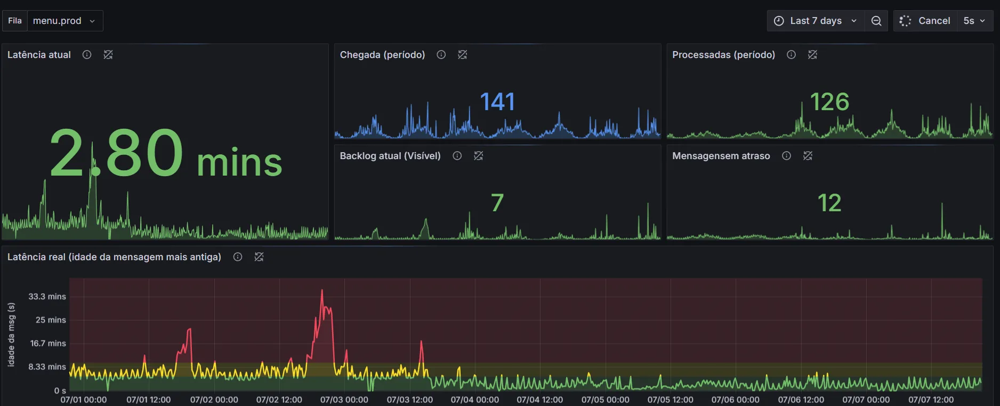

> Durante muito tempo, meu fluxo de correção terminava no deploy.
> Subia o fix, torcia, e seguia pra próxima demanda.
> Hoje ele termina em outro lugar: no dado que prova que resolveu.

Meados de junho de 2026. Um cliente relatou algo que dá frio na barriga em qualquer dev: o dinheiro em mãos não batia com o que o sistema mostrava. E não era um cliente qualquer — era do tipo rigoroso com valores, daqueles que conferem centavo por centavo. Ele não queria um pedido de desculpas. Queria entender **para onde o dinheiro tinha ido**.

Não é um erro 500 num log, não é um botão desalinhado. É dinheiro. E dinheiro divergindo é a coisa que mais rápido destrói a confiança de um cliente no seu sistema.

Esse caso consolidou uma mudança que eu já vinha construindo aos poucos: colocar análise e monitoramento de dados dentro do meu workflow — não como tarefa extra de fim de sprint, mas como parte do trabalho. E é justamente isso que a velocidade da IA anda fazendo todo mundo ignorar, eu incluso.

A tese deste texto é uma só: **o dado de produção é a única coisa que enxerga o que ninguém imaginou**. E por isso ele tem dois usos que na verdade são um — o **diagnóstico**, quando algo já quebrou e o dado revela a verdade que o código esconde, e o **monitoramento**, quando você olha o mesmo dado continuamente pra garantir que continua funcionando. Não são duas ferramentas. São o mesmo dado, olhado em dois momentos. Vou contar um caso de cada momento.

Não é um tutorial de Grafana nem um review de MCP. É a história de como eu parei de torcer e comecei a ver.

## Torcida: o deploy como linha de chegada

Vamos à parte desconfortável primeiro: durante muito tempo, meu fluxo de correção de bug era corrigir e torcer.

Subia o fix, olhava por cima, e seguia para a próxima demanda. Às vezes eu *achava* que tinha corrigido — e não tinha. Eu não tinha (e confesso: ainda estou construindo) a rotina de monitorar ativamente se o problema foi de fato resolvido em produção. Pra mim, o deploy era a linha de chegada. O que acontecia depois dele era problema do futuro — ou do suporte.

E antes que alguém culpe a IA por isso: não. Isso sempre foi preguiça de dev. A minha, principalmente.

O que a IA fez foi **industrializar** essa preguiça. Se antes eu entregava X correções por semana sem verificar nenhuma, agora entrego 3X — sem verificar nenhuma. A IA removeu quase todos os freios do desenvolvimento: escrever código ficou rápido, refatorar ficou rápido, entender código alheio ficou rápido. O único freio que ela não removeu foi a verificação. E quando tudo acelera menos uma etapa, essa etapa é a primeira que a gente pula.

O curioso é que a mesma IA que industrializa o achismo viria a ser a melhor ferramenta que já tive pra acabar com ele. Mas essa ficha só caiu no caso do dinheiro.

---

## O caso do dinheiro: quando o dado revelou o que o código escondia

Voltando ao cliente rigoroso. O palco era uma tela de **pós-fechamento de caixa**: no fim do expediente, ela consolidava o movimento pro operador conferir. Só que essa tela contabilizava vendas e recebimentos de fiado — e nada mais. O que ela não contabilizava: a **sangria**, que é a retirada de dinheiro físico do caixa no meio do expediente (pra não deixar valor demais na gaveta, pagar um fornecedor na porta, o motivo varia). O sistema permitia registrar a sangria. Só não a descontava nessa tela.

Resultado: o sistema mostrava **mais** dinheiro do que existia na gaveta. Na conta desse cliente, a diferença acumulada beirava mil reais em cerca de duas semanas. Pra quem confere centavo por centavo, isso não é arredondamento — é um buraco.

A investigação foi assim: usei a IA para ler o código e reconstruir as regras de negócio do fluxo financeiro, validando comigo cada entendimento. Em paralelo, ela consultava os valores reais do cliente no banco de dados, através de um MCP que eu mesmo construí (ele ganhou uma seção própria logo abaixo). Código de um lado, dado de produção do outro — e a divergência entre os dois foi apontando o caminho. Levou uns dois dias. No meu fluxo antigo — DBeaver aberto, SQL na unha, cruzando resultado de query com leitura manual de código legado — eu sinceramente nem imagino quanto tempo levaria. Só sei que não seriam dois dias.

E por que ninguém tinha visto antes? Porque era código legado, e a descrição da tela não deixava explícito que só entravam vendas. Com o tempo, virou aquilo que todo legado vira: os próprios devs *achavam* que o sistema descontava a sangria. A gente permitia a operação, afinal. O "bug" não era bug. Era um buraco de modelagem: o código estava fazendo exatamente o que foi mandado fazer; o problema é que ninguém tinha mandado ele considerar uma parte da realidade.

E esse é o ponto central deste texto: **nenhuma leitura de código, por mais cuidadosa, encontraria esse problema**. O código estava "certo". Todos os devs "sabiam" como a tela funcionava — e estavam errados. Quem revelou o buraco foi o dado.

Sou honesto sobre o desfecho: nós não remodelamos o fluxo. Não era a prioridade daquele momento, e outras demandas vieram na frente. O que fizemos foi esclarecer para o cliente exatamente o que aconteceu — uma troca de mensagens e um relatório detalhando tudo, com os números na mesa. E isso, sozinho, foi o suficiente para segurar a confiança dele — que era o que estava em jogo. O dado não virou feature; virou resposta. Às vezes é só disso que o cliente precisa: entender.

A objeção clássica do dev experiente: *"pra que investigar dado? escreve um teste de regressão que isso não acontece de novo."* E é aí que o caso do dinheiro fecha o argumento. Um teste só pega aquilo que **alguém pensou em testar**. Ninguém pensou na sangria — logo, nenhum teste, por mais completo, cobriria esse caso. Teste verde não prova que a realidade está certa; prova apenas que aquilo que você *imaginou* continua funcionando. O buraco não estava no que imaginamos: estava exatamente no que ninguém imaginou. E só uma coisa enxerga o que ninguém imaginou — o dado de produção.

---

## Como deixei a IA olhar meu banco de produção

Prometi voltar no MCP. Existem MCPs prontos para banco de dados, mas eu não queria que a IA pudesse fazer alterações, inserções ou deleções em produção — então fiz o meu, read-only por design, com guardrails em dois níveis.

Na aplicação, toda query passa por uma validação que bloqueia qualquer coisa que não seja leitura (existe uma lib em Python que faz exatamente isso). E no banco, a IA usa um usuário read-only com timeout. O número de conexões e as tabelas acessíveis também são limitados. Além disso, eu queria rastreabilidade: implementei log por usuário, então sei exatamente **quem** rodou **qual** consulta.

Se a pergunta na sua cabeça é "vou deixar uma IA solta no meu banco de produção?", a resposta é: não. Você deixa ela olhar, pelo buraco da fechadura que você construiu, e anota tudo que ela olhou.

---

## Fricção: por que eu nunca monitorei de verdade

Depois do caso do dinheiro, a pergunta óbvia: se dado é tão poderoso, por que eu nunca monitorava? A resposta honesta não é "falta de disciplina". É **fricção**.

Verificar uma correção, no meu fluxo antigo, significava: abrir o DBeaver, lembrar (ou reescrever) o SQL, rodar, e interpretar o resultado numa tabela de linhas e colunas. Cada verificação era um pequeno projeto. E verificação que exige um pequeno projeto não sobrevive à rotina de uma startup.

Compare com: abrir uma dashboard.

É isso. A diferença entre monitoramento que *acontece* e monitoramento que você *pretendia* fazer é a fricção entre você e o dado. Quanto menor a fricção de fazer algo, maior a chance daquilo virar hábito.

Então investi nisso. E não vou romantizar: trabalho em startup, ninguém tem tempo. Montar dashboards, construir MCP, configurar logs — tudo isso disputou espaço com demanda de cliente. O que me permitiu fazer foi uma mistura de aprender a dizer não, delegar algumas responsabilidades, e aceitar que esse esforço a mais era investimento, não desvio.

O custo real: a dashboard foi montada com Grafana. Implementar o Grafana e plugar os conectores (os data sources) levou pouco mais de uma semana. Montar a dashboard em si, depois disso, foram umas 3 horas — e muitos tokens. Comparado ao que passei a ter em troca, valeu cada minuto.

Foi aí que a pergunta que guiava meu pós-deploy mudou:

> Parei de perguntar:
> "será que resolveu?"
>
> E comecei a perguntar:
> "onde eu **vejo** se resolveu?"

---

## O loop fechado: ver em vez de achar

O retorno do investimento veio rápido, num caso concreto: a atualização de cardápio, um fluxo assíncrono que rodava com média de **10 minutos**, com picos de 20 a 60.

Antes de otimizar qualquer coisa, eu precisava de duas respostas: o gargalo era real ou era impressão minha? E se era real, onde exatamente ele estava? No fluxo antigo, eu teria chutado — provavelmente otimizado o lugar errado, do jeito que a gente costuma otimizar por instinto. Dessa vez, montei a dashboard antes de tocar no código.

O que ela mostra: quantas mensagens chegam na fila, quantas são processadas e — a métrica que importa — **a idade da mensagem mais antiga esperando**. Foi ela que respondeu a primeira pergunta, preto no branco: a média de 10 minutos era real, e os picos de até uma hora não eram anedóticos — aconteciam de verdade, com frequência. O gargalo deixou de ser suspeita e virou fato antes de eu escrever uma linha de correção.

Mas a dashboard não respondeu a segunda pergunta. Ela mostra o sintoma, não a causa — não temos tracing, *ainda*. O **onde** veio da leitura do código: era legado acumulando N+1 atrás de N+1 e operações de I/O bloqueantes rodando em sequência. Repare que é a mesma dupla do caso do dinheiro: **o dado diz que dói; o código diz onde dói**. Nenhum dos dois sozinho fecha o diagnóstico.

A correção foi menos glamourosa que o resultado — eager load pra matar os N+1, operações de I/O em concorrência e um tuning em como processávamos as mensagens do SQS. Com o I/O rodando em concorrência, o tempo total caiu pra aproximadamente o da operação mais lenta.

Feita a correção, não precisei montar nada de novo pra saber se tinha funcionado: era a mesma dashboard. A média caiu de 10 pra cerca de **3 minutos**; os picos, de até uma hora pra menos de **6**.

O gráfico conta a história sozinho: à esquerda do deploy, picos vermelhos passando de meia hora; à direita, verde — e não voltou. Eu não *acho* que otimizei. Eu **vejo** o quanto otimizei.

E aqui a tese se fecha: a peça que eu usei pra *diagnosticar* o problema é exatamente a que eu uso pra *monitorar* que ele continua resolvido. Diagnóstico e monitoramento não são duas ferramentas — são o mesmo dado, olhado em dois momentos.

Esse é o loop fechado: código → produção → evidência. Antes, meu loop terminava no deploy. Agora ele termina no dado.

E é aqui que o investimento se pagou — só que não numa métrica que eu consiga colocar numa planilha. Ele se pagou em **tranquilidade**. Uma preocupação a menos, uma certeza a mais. A calma que eu sinto depois de mandar algo pra produção aumentou muito. Não é que eu passei a entregar mais rápido ou a economizar X horas por semana; é que a ansiedade do "será que quebrou algo?" foi substituída por um lugar onde eu simplesmente *olho* e vejo. Pra mim, esse ROI valeu mais que qualquer número.

---

## O que ficou — e o que falta

Vou ser exato sobre o tamanho da vitória que estou vendendo: o deploy do cardápio faz **uma semana**. Nos dois primeiros dias, com a correção ainda fresca, fiquei monitorando constantemente. Agora abro casualmente — procuro algum pico, não acho, fecho. Isso ainda não é um hábito consolidado; é um hábito em teste. Escrever este texto, tornar isso público, é parte da aposta: fica mais caro desistir.

E tem uma rachadura nessa história que eu não vou esconder. A dashboard reduziu a fricção de *olhar* o dado — mas não resolve o *lembrar* de olhar. Hoje o meu monitoramento é *pull*: sou eu que abro a dashboard, quando lembro. E isso depende da mesma disciplina que confessei lá no começo não ter de sobra. Se o fluxo do cardápio regredir no mês três, quem me avisa? Ninguém. A dashboard não grita — ela espera eu chegar. Esse problema eu ainda não resolvi, e não vou fingir que resolvi.

A hipótese pra resolver é conhecida: alertas, com seus canais. Sair do *pull* e ir pro *push* — o dado vindo até mim quando algo foge do esperado. Mas com um cuidado que aprendi observando ambientes que erraram nisso: se tudo apita, nada apita. Alerta demais vira ruído, e ruído a gente aprende a ignorar. A dashboard foi o degrau; o alerta bem calibrado é a aposta seguinte — e por enquanto é só isso: uma aposta.

Sobre acesso a dados: sei que depende do tamanho e da maturidade da empresa. Gosto de transparência — mas comece pelos dados operacionais, que ninguém vai te negar. Latência de fila não é segredo de ninguém.

Então fica a pergunta, e responda de verdade: **qual foi a última demanda que, depois de chegar em produção, você se preocupou em saber se estava funcional e se tinha cliente usando?**

Se a resposta for "nenhuma" ou um silêncio constrangedor — por que não fazer isso agora? Procure no seu sistema. Monte uma query para saber o volume. Não tem acesso ao banco? Pergunte a alguém do suporte se o problema sumiu.

Monitorar o que você entrega também é sua responsabilidade. Essa história começou com um cliente conferindo, centavo por centavo, o que o meu sistema mostrava. O que mudou é que agora eu confiro antes dele. Continuo torcendo — mas só depois de olhar a dashboard.
